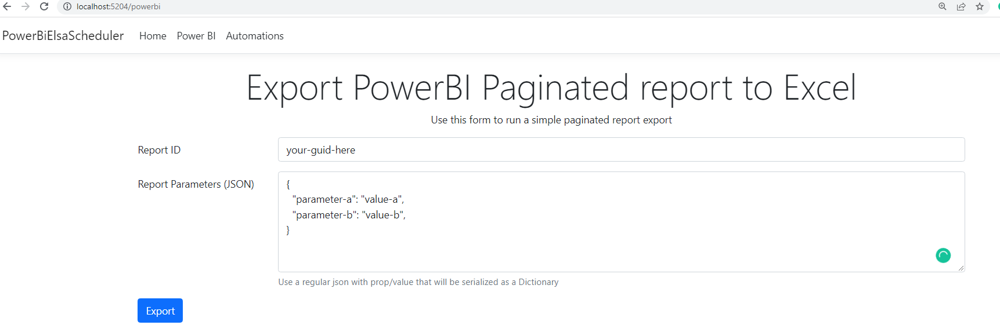

## Elsa Workflows + Power BI
This project is a proof of concepet on how we can use ELSA workflows to schedule a power bi paginated report export
and send the exported file by email.

## Configuring your environment
Replace the information in the `appsettings.json` with you AAD and PowerBI workspace configuration
For the local smtp server I'm using [smtp4dev](https://github.com/rnwood/smtp4dev)
```
docker run --rm -it -p 3000:80 -p 2525:25 rnwood/smtp4dev
```

## Exporting PowerBI Report
To test Power BI export file navigate to `/powerbi`

<p align="center">
  
</p>

## Sample Workflow
In order to simplfy the demo there's a sample file in the samples folder that you can import in the ELSA worfklow UI